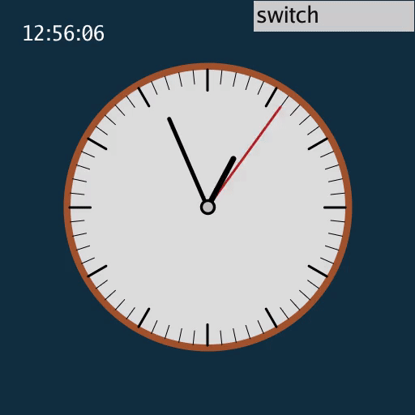
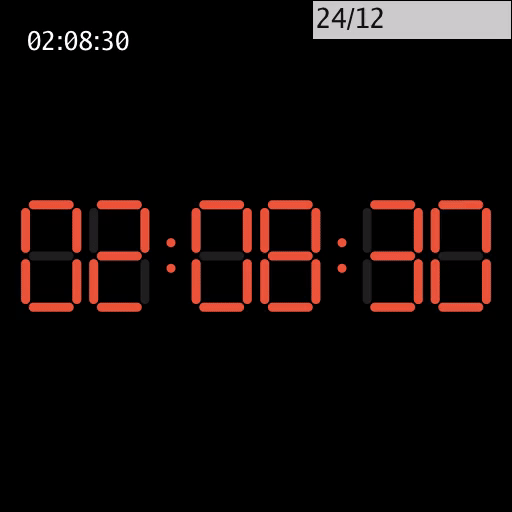

# taichi-play

使用太极图形做一些好玩的东西:stuck_out_tongue_winking_eye:

## 效果展示

### [Game of Life](game_of_life/)

<a href="gol.gif"></a>

### [Solar System](solar_system/)

<a href="ss.gif">

### [Clock](clock/)

<a href="wall_clock.gif">

<a href="digi_clock.gif">

## 整体结构

```
├── LICENSE
├── requirements.txt
├── game_of_life
│   ├── game_of_life.py
│   ├── imgs
│   │   ├── beacon.gif
│   │   ├── blinker.gif
│   │   ├── glider.gif
│   │   └── gol.gif
│   └── README.md
├── solar_system
│   ├── solar_system.py
│   ├── README.md
│   ├── main.py
│   └── imgs
│       └── ss.gif
├── clock
│   ├── digi_clock.py
│   ├── wall_clock.py
│   ├── imgs
│   │   ├── digi_clock.gif
│   │   └── wall_clock.gif
│   └── README.md
└── README.md
```

## 运行环境

```
[Taichi] version 0.8.3, llvm 10.0.0, commit 5c4ac743, linux, python 3.8.10
```

### 使用GUI时生成GIF

在图片目录下

```shell
ti video -f 50
ti gif -i video.mp4
```

### 使用GGUI时生成GIF

[ScreenToGif](https://github.com/NickeManarin/ScreenToGif/releases/tag/2.34)
