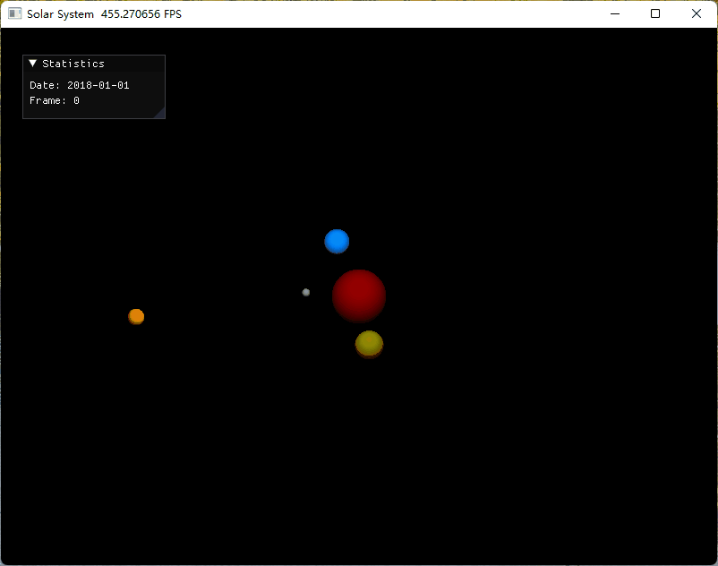

# taichi-play

使用太极图形做一些好玩的东西:stuck_out_tongue_winking_eye:

## 效果展示

### [Game of Life](game_of_life/)


### [Solar System](solar_system/)



## 整体结构

```
├── LICENSE
├── requirements.txt
├── game_of_life
│   ├── game_of_life.py
│   ├── imgs
│   │   ├── beacon.gif
│   │   ├── blinker.gif
│   │   ├── glider.gif
│   │   └── gol.gif
│   └── README.md
├── solar_system
│   ├── solar_system.py
│   ├── README.md
│   ├── main.py
│   └── imgs
│       └── ss.gif
└── README.md
```

## 运行环境

```
[Taichi] version 0.8.1, llvm 10.0.0, commit cc2dd342, win, python 3.8.10
```

### 使用GUI时生成GIF

在图片目录下

```shell
ti video -f 50
ti gif -i video.mp4
```

### 使用GGUI时生成GIF

**ScreenToGif**

[Release ScreenToGif 2.34 · NickeManarin/ScreenToGif (github.com)](https://github.com/NickeManarin/ScreenToGif/releases/tag/2.34)
