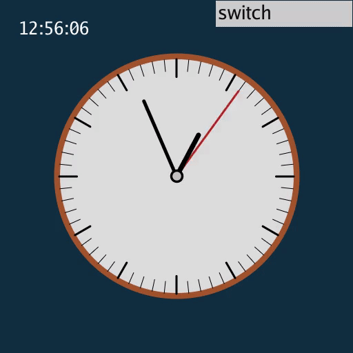

# Clock

## 背景介绍

时钟。

### 功能介绍

墙上时钟

- 按键`Esc`退出GUI
- 按钮`switch`切换秒针是否连续转动，初始时不连续转动

数字时钟

- 按键`Esc`退出GUI
- 按钮`24/12`切换小时制，初始时为24小时制

## 效果展示

<a href="wall_clock.gif">

<a href="digi_clock.gif"></a>

## 运行方式

```shell
python wall_clock.py
python digi_clock.py
```

## 参考资料

1. [Input - Time (shadertoy.com), by Inigo Quilez, @iquilezles and iquilezles.org](https://www.shadertoy.com/view/lsXGz8)
2. [Digital clock (shadertoy.com)](https://www.shadertoy.com/view/MdfGzf)

