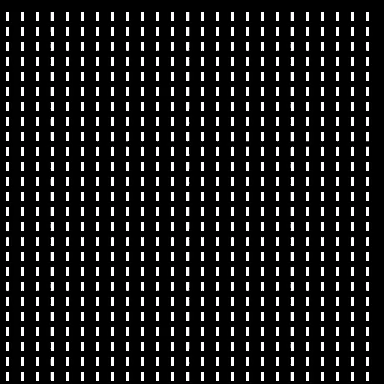

# Game of Life

## 背景介绍

John H Conway（1937-2020）于1970年发明生命游戏，一种二维的元胞自动机。这个游戏中有一个向各个方向无限延伸的二维世界，并且被划分为一个个细胞。任意一代中，每个细胞处于活着或死去的状态。游戏包含一套规则，描述了每一代细胞是如何进化的。

在二维世界中，一个细胞在垂直、水平和对角方向共相邻8个细胞。进化规则如下：

1. 1个活细胞相邻少于2个活细胞时，将死去；
2. 1个活细胞相邻多于3个活细胞时，将死去；
3. 1个活细胞相邻恰好2个或3个活细胞时，将存活；
4. 1个死细胞相邻恰好3个活细胞时，将复活。

### 功能介绍

目前提供以下4种初始化模式：

1. **init_random**()，以`live_ratio`为存活率随机生成活细胞。
2. **init_blinker**()，一种振荡状态，在全局每个5x5的单元中设置活细胞。
3. **init_beacon**()，一种振荡状态，在全局每个6x6的单元中设置活细胞。
4. **init_glider**()，一种会移动的振荡状态，在左上角设置。

## 效果展示

<a href="gol.gif"></a>
<a href="glider.gif"></a>
<a href="blinker.gif"></a>
<a href="beacon.gif"></a>

## 运行方式

```shell
python game_of_life.py
```

## 参考资料

[^1]: [Conway's Game of Life - Wikipedia](https://en.wikipedia.org/wiki/Conway's_Game_of_Life)
[^2]: [Lab 1: Game of Life (mit.edu)](https://ocw.mit.edu/courses/electrical-engineering-and-computer-science/6-087-practical-programming-in-c-january-iap-2010/labs/MIT6_087IAP10_lab01.pdf)
