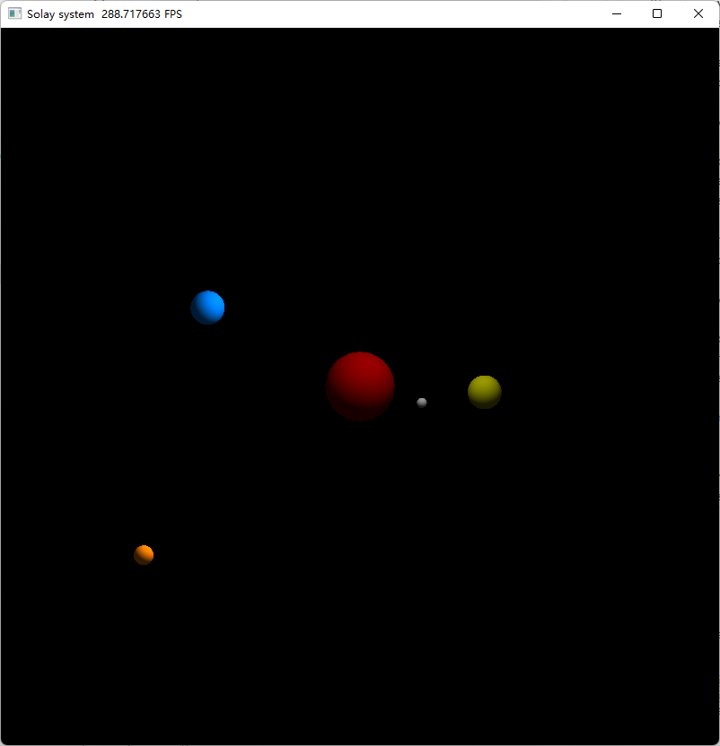

# Solar System

## 背景介绍

太阳系模拟。

使用2018-01-01这一天的天体数据。

### 功能介绍

水星、金星、地球、火星比例接近真实值，为了能够看到这些行星，太阳并非真实大小。

木星的轨道半径非常大，会影响到地球的观测，暂时未加入更大轨道上的行星。

### TODO

- 对于相机、光线的控制不太熟悉，交互需要改进。
- 绘制天体运动的轨迹。
- 加入太阳系的其它行星。
- 加入地月系统。

## 效果展示

<a href="gol.gif"></a>

## 运行方式

```shell
python main.py
```

似乎是一个bug，GGUI不能使用shape=()的field，但是shape=1是可以的。

## 参考资料

1. [用86行Python代码模拟太阳系 - 知乎 (zhihu.com)](https://zhuanlan.zhihu.com/p/102375135)
2. [chongchonghe/Python-solar-system (github.com)](https://github.com/chongchonghe/Python-solar-system)
3. [Horizon API (nasa.gov)](https://ssd-api.jpl.nasa.gov/doc/horizons.html)
4. [Home – NASA Solar System Exploration](https://solarsystem.nasa.gov/)
5. [Planetary Physical Parameters (nasa.gov)](https://ssd.jpl.nasa.gov/planets/phys_par.html)
6. [Build Your Solar System | SimPop](https://simpop.org/solar-system/solar-system.htm)

## 附录

太阳系（Solar System）。

| Solar System |   Numbers |
| ------------ | --------: |
| Planets      |         8 |
| Moons        |      200+ |
| Asteroids    | 1,113,527 |
| Comets       |     3,743 |

### Sun

| Name | Star-type           | Age     | Radius, KM | Distance from Galactic Center |
| ---- | ------------------- | ------- | ---------- | ----------------------------- |
| Sun  | 黄矮星 Yellow Dwarf | ~45亿年 | 695500.0   | 26000光年                     |

### Planets

| Name           | Star-type            | Moons | Mean Radius, KM | Length of Year     | Distance from Sun, AU |
| -------------- | -------------------- | ----- | --------------- | ------------------ | --------------------- |
| 水星 Mecury    | 类地行星 Terrestrial | 0     | 2439.4          | 88 Earth Days      | 0.4                   |
| 金星 Venus     | 类地行星             | 0     | 6051.8          | 225 Earth Days     | 0.7                   |
| 地球 Earth     | 类地行星             | 1     | 6371.0          | 365.25 Days        | 1                     |
| 火星 Mars      | 类地行星             | 2     | 3389.5          | 1.88 Earth Years   | 1.5                   |
| 木星 Jupiter   | 气体巨星 Gas Giant   | 79    | 69911.0         | 11.86 Earth Years  | 5.2                   |
| 土星 Saturn    | 气体巨星             | 62    | 58232 .0        | 29.45 Earth Years  | 9.5                   |
| 天王星 Uranus  | 冰巨星 Ice Giant     | 27    | 25362.0         | 84 Earth Years     | 19.8                  |
| 海王星 Neptune | 冰巨星               | 14    | 24622.0         | 164.81 Earth Years | 30.1                  |
| 冥王星 Pluto   | 矮行星 Dwarf Planet  | 5     | 1188.3          | 248.89 Earth Years | 39                    |

**PS：**

1. AU：天文单位（Astronomical Unit），地球与太阳间的平均距离，约为1.496亿千米。

### Moons

| Name              | Star-type            | Mean Radius, KM | Length of Year | Distance from Earth, KM |
| ----------------- | -------------------- | --------------- | -------------- | ----------------------- |
| 月球 Earth's Moon | 类地行星 Terrestrial | 1737.5          | 27 Earth Days  | 385000                  |

